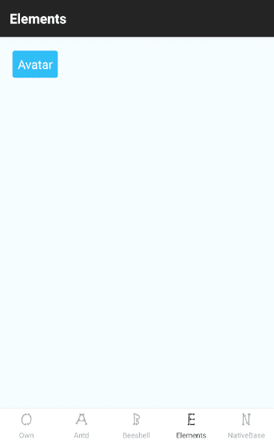
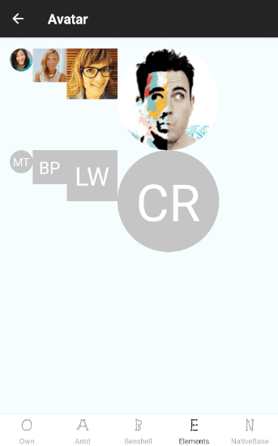

# react-native-own

如何自定义你自己的 React Native 组件


## 概述

目前 React Native 第三方组件库比较多，下面选取了几个可用性比较高的组件库：

| 组件库 | 组件库示例 | 组件库文档 | 组件数量
| -- | -- | -- | --
| [react-native-elements](https://github.com/react-native-training/react-native-elements) | [react-native-elements-app](https://github.com/react-native-training/react-native-elements-app) | [docs](https://react-native-training.github.io/react-native-elements/) | 16
| [NativeBase](https://github.com/GeekyAnts/NativeBase) | [NativeBase-KitchenSink](https://github.com/GeekyAnts/NativeBase-KitchenSink) | [docs](https://nativebase.io/) | 28
| [ant-design-mobile-rn](https://github.com/ant-design/ant-design-mobile-rn) | - | [docs](http://rn.mobile.ant.design/index-cn) | 41
| [beeshell](https://github.com/meituan/beeshell) | - |  - | 25

俗话说，知其然知其所以然。

本项目参考上述代码 **设计了自己的组件库**，附带 **示例代码** 和 **设计分析**。


## 截图

| 组件列表 | 组件详情
| -- | --
|  | 

> 截图不定期更新，以最新代码为准。


## 组件

* SearchBar - 源码 - 如何使用 - 设计分析


## 结构

```
..
├ android
├ ios
├ screenshots         模拟器屏幕截图
├ src                 源代码
|   assets            公共资源
|     icons           图标
|   components        公共组件
|     Button.js       按钮
|   examples          示例
|     antd            ant-design-mobile-rn
|     beeshell        beeshell
|     elements        react-native-elements
|     nativebase      NativeBase
|     own           
|       components    自己写的组件库
|       pages         示例页面
|       OwnStack.js   单独的路由配置
|   styles            公共样式
|     colors.js       颜色
|     sheets.js       样式
├    app.json         App 信息配置
├    App.js           App 路由配置（各个示例入口）
├ index.js            App 入口
```

## Licenses

```
 Copyright 2018 zhuanghongji

 Licensed under the Apache License, Version 2.0 (the "License");
 you may not use this file except in compliance with the License.
 You may obtain a copy of the License at

      http://www.apache.org/licenses/LICENSE-2.0

 Unless required by applicable law or agreed to in writing, software
 distributed under the License is distributed on an "AS IS" BASIS,
 WITHOUT WARRANTIES OR CONDITIONS OF ANY KIND, either express or implied.
 See the License for the specific language governing permissions and
 limitations under the License.
```
